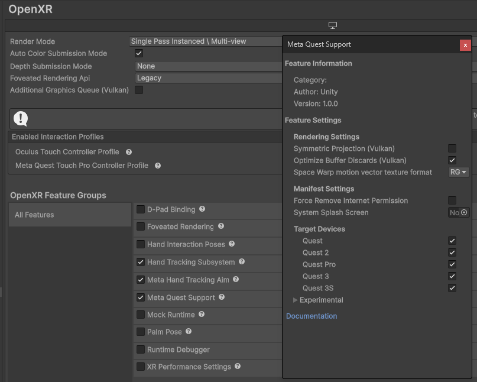
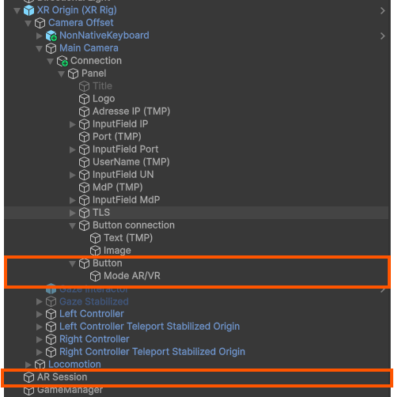
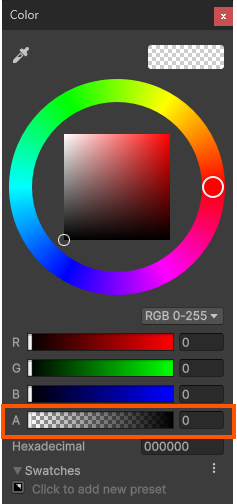
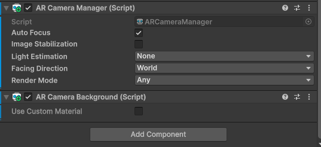
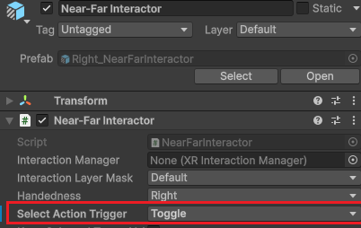

:toc: macro

= Documentation Technique SAE-LocURa4IoT

=== Sommaire
toc::[]

== Équipe 2024-2025

Groupe :

- GUILLUY Matt
- AMERI Mohammed
- RAZAFINIRINA Mialisoa
- TRAN David
- DUCRY Pierre-Louis

== Présentation du projet

=== Contexte Général

Client : IRIT
Objectif : Sujet autour de la réalité virtuelle pour l'accès à distance de la plateforme LocURa4IoT.
Un modèle 3D a été développé l'année dernière par un graphiste
sous Unity. L'idée du projet serait de faire évoluer le modèle 3D pour permettre l'ajout d'objets dynamiquement dans l'environnement.
C'est aujourd'hui faisable, mais il faut rentrer dans le code et
recompiler...
L’objectif du projet serait donc de
développer une API.
Technologie : Unity

=== Objectif du Projet

Ajouter dynamiquement des nœuds dans l'environnement virtuel de LocURa4IoT.


Le projet *LocURa4IoT VR* permet de visualiser et manipuler en réalité virtuelle des nœuds IoT (fixes, mobiles et estimés) et leurs mesures de ranging. L’application Unity récupère des messages MQTT en temps réel, instancie des objets 3D correspondants et met à jour leur état (position, liens, affichage).

=== Organisation générale

```
/LocURa4IoT/
├── Assets/
│   ├── Animations/
│   ├── Icons/
│   ├── Material/
│   ├── Model/
│   ├── MRTK-Keyboard-main/
│   ├── Plugins/
│   ├── PositionsWristMenu/
│   ├── Prefab/
│   ├── Resources/
│   ├── Scenes/
│   ├── Scripts/
│   ├── Settings/
│   ├── Texture/
│   ├── XR/
│   └── XRI/
├── Packages/
├── ProjectSettings/
├── Library/
├── Logs/
├── Temp/
├── obj/
├── IoT_Lab.sln
└── apk/
```

=== Architecture logique
[cols="1,3"]
|===
| Composant | Rôle

| Casque Meta Quest 3 (Android) / PC (Link) | Exécution de l’app Unity (OpenXR), rendu VR et interactions XRI.
| Application Unity | Scène VR, scripts de gestion des nœuds (`NodeGenerator`, `SetNodePosition`, etc.), UI.
| SDK XR | OpenXR + XR Interaction Toolkit (+ Meta XR AIO SDK si fonctionnalités avancées).
| Réseau | Wi‑Fi local ou USB Link ; accès au broker MQTT.
| Broker MQTT | Transport pub/sub des messages capteurs et commandes (Mosquitto/EMQX/HiveMQ).
| Dispositifs IoT (ESP32/Arduino/RPi) | Publication des topics de localisation, ranging, état.
|===

=== Flux principal (séquence)
. Le dispositif IoT publie sur un topic `localisation/<nodeId>/...` un message JSON avec ses informations.
. Unity (script MQTT) s’abonne aux topics configurés et met en file les messages reçus (thread-safe).
. `NodeGenerator` détecte un *node inconnu* et instancie le prefab approprié (fixe/mobile/estimé) + UI.
. Les scripts `Set*Position` appliquent les mises à jour (position, lignes de communication, sphères de ranging).
. L’utilisateur visualise et interagit en VR (Quest 3 via Link ou APK standalone).

== Structure du code (extraits)

=== `NodeGenerator`
*Rôle* : instancie dynamiquement les nœuds (fixes, mobiles, estimés), crée les éléments de ranging et leurs UI.

*Points clés d’implémentation* :
- **Helpers** : `ExtractNodeName`, `CreateNodeLabel` pour éviter duplication et exceptions.
- **Instantiate(prefab, parent)** : parentage direct, moins de travail *Transform*.
- **Caching `GetComponent`** : réduit appels répétés, plus lisible.
- **Recherche d’ancre** : break dès correspondance ; à terme préférer `Dictionary<nodeId, Transform>` (O(1)).
- **Threading** : toute instanciation doit rester sur le **main thread**.

==== Exemple de parsing robuste
[source,csharp]
----
private string ExtractNodeName(string topic, string startTag, string endTag) {
    int start = topic.IndexOf(startTag);
    if (start == -1) return topic;
    start += startTag.Length;
    int end = topic.IndexOf(endTag, start);
    if (end == -1 || end <= start) return topic.Substring(start);
    return topic.Substring(start, end - start);
}
----


=== `ObjectFactory`

*Rôle* : Gère l'instanciation dynamique des objets complexes (mobiliers, décors) via MQTT, en gérant les sources locales (Resources) ou distantes (URL).

*Points clés d’implémentation* :
- **Cascade de chargement** : Priorité donnée à l'URL (`GLTFast`), puis au catalogue manuel (`localCatalog`), puis au dossier `Resources`.
- **Gestion des Primitives** : Si aucune ressource n'est trouvée, le script génère une forme basique définie par le champ `shape` (cube, sphère, cylindre).
- **Physique dynamique** : Calcule automatiquement un `BoxCollider` basé sur les dimensions réelles du modèle importé via la méthode `FitColliderToChildren`.
- **Sécurité et Placement** : Intègre un système de "Y-Clamp" pour garder l'objet au-dessus du sol et un script de `RespawnIfFallen` automatique en cas de chute hors de la carte (Y < -10m).


==== Exemple de sélection de la source (Logique)
[source,csharp]
----
if (!string.IsNullOrEmpty(payload.url)) {
    go = await CreateFromUrlAsync(payload.url, parent); // Source Web (GLTF)
} else {
    GameObject prefab = SearchInCatalog(payload.prefab) ?? Resources.Load<GameObject>(payload.prefab);
    if (prefab != null) go = Instantiate(prefab, parent);
    else go = CreatePrimitiveFromShape(payload.shape); // Secours en forme primitive
}
----

=== `GrabPublishHandler` (Synchronisation Inverse)

*Rôle* : Permet de renvoyer vers le broker MQTT la nouvelle position d'un objet déplacé manuellement par l'utilisateur en VR.

*Points clés d’implémentation* :
- **Détection d'interaction** : S'active uniquement si le champ `grabbable` est défini à `true` dans le payload reçu.
- **Optimisation réseau** : La publication ne se déclenche que si l'objet a bougé d'une distance supérieure au seuil `publishMoveThreshold` et respecte le `publishRateHz`.
- **Mode Retained** : La publication vers le broker utilise systématiquement le flag *Retained* pour que la position modifiée devienne la nouvelle référence pour tous les clients.


== Méthodes principales dans le projet

[cols=\"2,4,2\"]
|===
| Classe | Méthode | Effet

| NodeGenerator | CreateNewNode(name) | Instancie un nœud fixe + label + `SetupMQTT`.
| NodeGenerator | CreateNewMobileNode(name) | Instancie un nœud mobile + label + `SetupMQTT`.
| NodeGenerator | CreateNewEstimatedNode(name) | Instancie un nœud estimé + label + `SetupMQTT` et lignes.
| NodeGenerator | CreateNewRanging(topic) | Crée l’empty de ranging, rattache à l’ancre, initialise `Ranging`.
| SetNodePosition | SetupMQTT(...) | Abonnements + application des positions pour nœuds fixes.
| SetMobileNodePosition | SetupMQTT(...) | Idem pour mobiles.
| SetEstimatedNodePosition | SetupMQTT(...) | Idem pour estimés + `LineRenderer` (erreur/communication).
| Ranging | SetupMQTT(...) | Représentation temps réel du ranging (lignes + sphères).
| ObjectFactory | CreateOrUpdateFromPayload(topic, json) | Analyse le JSON et décide s'il faut créer un nouvel objet ou mettre à jour l'existant.
| ObjectFactory | FitColliderToChildren(go) | Calcule et applique un collider physique sur mesure basé sur les "Bounds" du modèle.
| NodeGenerator | CreateNewNode(name, shape) | (Mise à jour) Intègre désormais le choix de la forme du mesh (cube, sphere, cylinder).
| GrabPublishHandler| PublishState() | Génère le payload JSON actuel et l'envoie vers le broker MQTT après manipulation.
|===

== Réalité Mixte (AR)

Cette section technique détaille l'implémentation du Passthrough (vue caméra) sur le projet existant Unity OpenXR.

=== Prérequis & Configuration OpenXR

L'activation de la réalité mixte repose sur la stack OpenXR standard d'Unity combinée au support Meta.

**Configuration requise (XR Plug-in Management) :**

* Plateforme : Android
* Plug-in Provider : **OpenXR** 
* Feature Group : **Meta Quest Support** 



=== Architecture de la Scène

Pour permettre le Passthrough, la hiérarchie de la scène a été modifiée comme suit :

. **AR Session** : Ajout d'un objet `AR Session` à la racine (nécessaire au cycle de vie AR).
. **Main Camera** : Configuration spécifique pour la transparence.
  * *Clear Flags* : Solid Color
  * *Background* : Noir avec Alpha = 0 (RGBA: 0,0,0,0)
  * *Composant* : Ajout du script `AR Camera Manager`







=== Script de Bascule (ToggleAR)

Un script dédié `ToggleAR.cs` gère l'activation/désactivation du Passthrough au runtime via l'UI.

**Logique du script :**
* **Mode AR** : Active `ARCameraManager` + Force le fond de caméra à transparent (Alpha 0).
* **Mode VR** : Désactive `ARCameraManager` + Remet le fond de caméra en Skybox.

**Câblage UI :**
Le script est attaché à un GameObject `GameManager` et référencé par l'événement `OnClick` du bouton UI.


==== Script ToggleAR.cs
[source,csharp]
----
public class ToggleAR : MonoBehaviour
{
    // Glissez ici votre Main Camera dans l'inspecteur
    public Camera mainCamera;

    // Le composant qui gère le flux vidéo (trouvé automatiquement ou assigné manuellement)
    private ARCameraManager arManager;

    void Start()
    {
        // Si non assigné, on le cherche sur la caméra
        if (mainCamera == null) mainCamera = Camera.main;
        arManager = mainCamera.GetComponent<ARCameraManager>();
    }

    // Fonction à appeler depuis un Bouton UI (On Click)
    public void SwitchMode()
    {
        if (arManager == null) return;

        // Inverse l'état actuel (Si activé -> désactive, et vice versa)
        bool isARActive = !arManager.enabled;
        arManager.enabled = isARActive;

        // Change le fond : Noir transparent pour AR, Skybox (ou couleur pleine) pour VR
        if (isARActive)
        {
            mainCamera.clearFlags = CameraClearFlags.SolidColor;
            mainCamera.backgroundColor = new Color(0, 0, 0, 0); // Noir transparent
        }
        else
        {
            mainCamera.clearFlags = CameraClearFlags.Skybox; // Remet le ciel VR par défaut
            // Ou CameraClearFlags.SolidColor avec une couleur grise/bleue si vous préférez
        }
    }
}
----


== Tests et validation

Des tests EditMode ont été mis en place pour valider la robustesse du script `ToggleAR` (gestion des composants nuls, assignation caméra).

=== Extraits de tests unitaires
[source,csharp]
----
    [Test]
    public void SwitchMode_WithNullARManager_DoesNotThrow()
    {
        // Cas : Pas de ARCameraManager sur la caméra
        // On simule le Start pour initialiser les variables internes
        toggleAR.SendMessage("Start");

        Assert.DoesNotThrow(() => toggleAR.SwitchMode());
    }

    [Test]
    public void SwitchMode_WithNullARManager_DoesNotChangeCameraFlags()
    {
        // Arrange
        toggleAR.SendMessage("Start");
        CameraClearFlags initialFlags = testCamera.clearFlags;

        // Act
        toggleAR.SwitchMode();

        // Assert : Rien ne doit changer car le manager est absent
        Assert.AreEqual(initialFlags, testCamera.clearFlags);
    }
----

---

## Fonctionnalités d'Interaction Avancées

Cette section détaille les améliorations ergonomiques pour la manipulation des objets.

### 1. Saisie Persistante (Toggle Grab)
Pour réduire la fatigue musculaire, le mode de saisie est passé d'un maintien constant à une bascule.

* **Composant** : `Near-Far Interactor` (sur les contrôleurs).
* **Réglage** : Propriété `Select Action Trigger` modifiée de `State` vers **`Toggle`**.
* **Effet** : Un clic pour attraper, un second clic pour lâcher.



### 2. Rappel Intelligent (`TabletControlManager`)
Permet de téléporter la tablette dans la main gauche via un **double-clic**, avec une gestion stricte des conflits physiques.

#### Séquence de Téléportation
Une coroutine gère le cycle pour assurer une transition fluide sans collision.

```csharp
private IEnumerator TeleportAndGrabSequence()
{
    yield return new WaitForEndOfFrame();
    
    // 1. Désactivation physique
    tabletRigidbody.isKinematic = true;

    // 2. Déplacement
    tablet.transform.position = leftControllerTransform.TransformPoint(teleportOffset);
    tablet.transform.rotation = leftControllerTransform.rotation;

    yield return new WaitForFixedUpdate();

    // 3. Force Grab via XR Interaction Manager
    interactionManager.SelectEnter(interactor, grabInteractable);
    
    // 4. Réactivation physique gérée au relâchement
}
```

#### Gestion du verrouillage (State Safety)
Le script empêche le rappel si l'objet est déjà tenu pour éviter les bugs de physique.

```csharp
private void OnButtonPressed(InputAction.CallbackContext context)
{
    // Verrou : Si la tablette est déjà tenue, on ignore le clic
    if (isBeingHeld) return;

    double currentTime = Time.timeAsDouble;
    if ((currentTime - lastClickTime) < doubleClickTimeWindow)
    {
        TeleportTabletToHand();
    }
    lastClickTime = currentTime;
}

