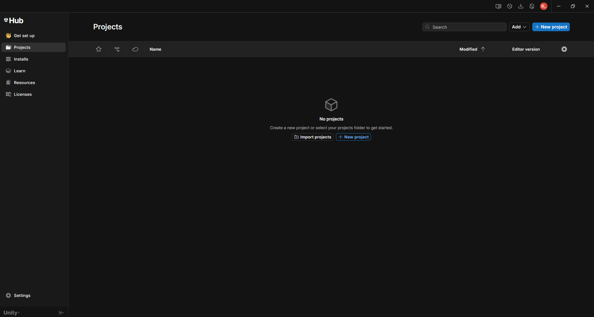
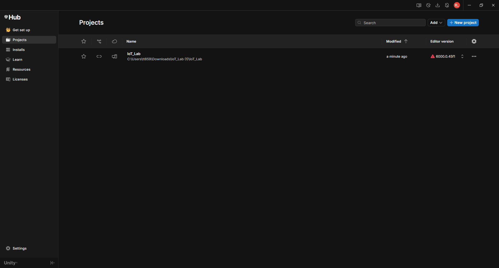
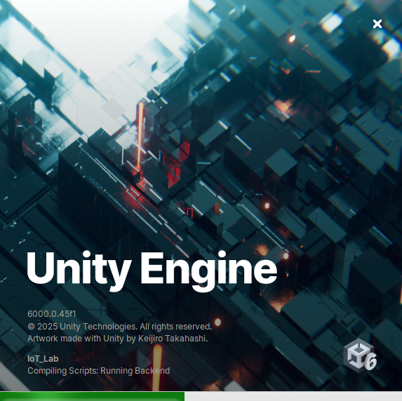
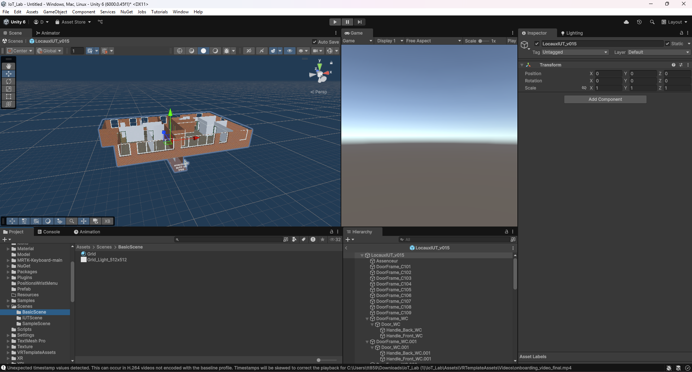

:toc-title: Sommaire
:toc: macro
:toclevels: 3
:sectnums:

= Documentation Utilisateur

toc::[]

== Présentation de l’application

=== Contexte général

****
**Nom du projet :** LocURa4IoT
****

=== Sujet et présentation

****
Le projet porte sur la réalité virtuelle appliquée à l’accès à distance de la plateforme **LocURa4IoT**.  
Un modèle 3D a été développé l’année dernière par un graphiste sous **Unity**.  
L’objectif est de faire évoluer ce modèle pour permettre l’ajout dynamique d’objets dans l’environnement.

****

== Installation

=== Prérequis matériels et logiciels

****
- **PC Windows 10/11** (recommandé pour Link).  
  *macOS* peut compiler un APK Android mais **Meta Quest Link** (Play in Editor) n’est **pas** supporté sur macOS.
- **Meta Quest 3** + câble USB-C (ou Wi-Fi via Air Link)
- **Unity Hub**
- **Visual Studio** (recommandé)
****

=== Étapes d’installation

. Installer https://unity.com/fr/download[Unity Hub et Unity].  
  Version recommandée : *2021.3.18f1 LTS* ou la dernière LTS supportée.
. Installer https://developer.android.com/studio?hl=fr[Android Studio].  
  Recommandé pour la compilation Android.
. Installer le https://assetstore.unity.com/packages/tools/integration/meta-xr-all-in-one-sdk-269657[Meta XR All-in-One SDK].  
  *(Remplace **Oculus Integration**, désormais déprécié.)*

== Configuration Unity

****
Se connecter à son **compte Unity** (gratuit).
****

. Ouvrir **Unity Hub**  

. Importer le projet Unity (bouton *Add* en haut à droite)  

. Ouvrir le projet  

. Exemple de projet ouvert  

== Fonctionnalités 

=== Distinction entre les différents catégories de nodes 

Cette fonctionnalité permet de définir l'apparence physique de chaque catégorie de capteur (Node) dans l'environnement 3D. Le choix de la forme se fait exclusivement via le champ `shape` envoyé dans le message JSON.

==== Choix de la forme

Il n'y a pas de configuration complexe : il vous suffit d'indiquer la forme souhaitée dans votre message. Cela permet de distinguer visuellement, par exemple, un type de capteur d'un autre (ex: Type A en carré, Type B en sphère).

[source,json]
----
{
  "shape": "sphere"
}
----

==== Formes disponibles et comportement

Le système propose trois modèles 3D par défaut. Si vous n'envoyez pas le champ `shape`, ou si vous écrivez une valeur inconnue, le système appliquera la forme **Carré** par défaut.

[cols="1,2", options="header"]
|===
| Valeur du champ `shape` | Résultat dans l'environnement virtuel
| `cube` | **Carré**.
| `sphere` | **Sphère**.
| `cylinder` | **Cylindre** (Forme optionnelle pour de nouveaux types de capteurs).
|===

=== Ajout dynamique d'objets 3D via MQTT 
Cette section explique comment le client peut interagir avec un objet 3D dans l'environnement virtuel en envoyant des messages au format JSON via le protocole MQTT.
***Format du message JSON***
Pour pouvoir ajouter un objet dans la scène, il faut publier un JSON structuré comme suit :
[source,json]
----
{
  "id": "chaise_salon_01",
  "prefab": "M_Chair_Wooden" ou "url": "",
  "position": {"x": 1.5, "y": 0, "z": -2.0},
  "rotation": {"x": 0, "y": 90, "z": 0},
  "scale": {"x": 1, "y": 1, "z": 1},
  "color": "#3357FF",
  "shape": "cube",
  "grabbable": true,
  "timestamp": 1705856000
}
----
***Les champs détaillés***
[cols="1,1,1,3", options="header"]
|===
| Champ | Type | Obligatoire | Description & Valeurs par défaut

| `id` | String | **Oui** | Identifiant unique. Si l'ID existe déjà, l'objet sera déplacé. Sinon, il sera créé.
| `prefab` | String | Optionnel* | Nom de l'objet dans la bibliothèque interne (ex: `Table`, `Chair`).
| `url` | String | Optionnel* | Lien direct vers un fichier `.glb` externe (prioritaire sur le prefab).
| `position` | Vector3 | Non | Coordonnées spatiales. **Par défaut :** `(0, 0.2, 0)`.
| `rotation` | Vector3 | Non | Angles d'orientation. **Par défaut :** `(0, 0, 0)`.
| `scale` | Vector3 | Non | Échelle/Taille de l'objet. **Par défaut :** `(1, 1, 1)`.
| `color` | String | Non | Code couleur Hexadécimal (ex: `#FFFFFF`).
| `shape` | String | Non | Forme de secours (`cube`, `sphere`, `cylinder`) si le modèle est introuvable.
| `grabbable`| Boolean| Non | Permet de saisir l'objet à la main en VR. **Par défaut :** `false`.
| `timestamp`| Long | Non | Horodatage pour la synchronisation des mouvements.
|===

[IMPORTANT]
====
Le système ajoute automatiquement **+0.2m** à la position `y` indiquée et possède une sécurité "Clamp" qui empêche l'objet de passer à travers le sol défini par le système.
====

==== Méthodes d'ajout

Il existe deux façons d'intégrer un objet selon la provenance de la ressource.

====== 1. Objets de la bibliothèque interne (Pré-configurés)

Dans le dossier `ressources` du projet, un catalogue d'objets est déjà défini.
 * Pour les utiliser, renseignez le nom exact dans le champ `prefab`.
 * **Système de secours (Fallback) :** Si le nom est introuvable, le système analyse le texte. Si le mot "chair" ou "chaise" est détecté, il chargera un modèle générique. À défaut, il créera la forme géométrique spécifiée dans `shape`.

======  2. Objets depuis un lien externe
Pour ajouter un objet absent de la bibliothèque :
 * Renseignez le champ `url` avec un lien direct vers un fichier **.glb**.
 * Le système télécharge et instancie l'objet dynamiquement. Cette méthode est prioritaire : si une URL est valide, le champ `prefab` est ignoré.

==== Le mode "Retained" (Mémoire d'état)

Lors de la publication de vos messages sur MQTT, vous devez impérativement activer l'option **Retained** (Message Persistant).

* **Pourquoi ?** Cela permet au Broker MQTT de stocker le dernier état de l'objet.
* **Résultat :** Si l'application Unity redémarre ou qu'un nouvel utilisateur se connecte, tous les objets réapparaissent instantanément à leur dernière position connue. Sans cela, la scène serait vide à chaque redémarrage.

==== Comportement et Physique

===== Saisie manuelle (Interaction VR)
Si `grabbable` est à `true` :

1. Un utilisateur peut attraper et déplacer l'objet manuellement.
2. **Auto-Publication :** Dès que l'objet est lâché, il envoie automatiquement sa nouvelle position sur le topic MQTT. Tous les autres clients connectés voient alors l'objet se déplacer.

===== Sécurité anti-perte (Respawn)
Si un objet subit une collision imprévue et tombe "sous la carte" (Y < -10m) :

* Il est automatiquement téléporté à sa position de départ.
* Sa vitesse est réinitialisée pour stopper sa chute.

===== Synchronisation par Timestamp
Le champ `timestamp` (horodatage) garantit que les commandes sont traitées dans le bon ordre. Si le système reçoit un message dont le timestamp est inférieur (plus ancien) à celui déjà enregistré pour cet objet, le message est ignoré. Cela évite les "sauts" de position dus aux latences réseau.

=== Tutoriel immersif pour les débutants

=== Optimisation de l'interaction avec les objets dans l'environnement virtuel 

