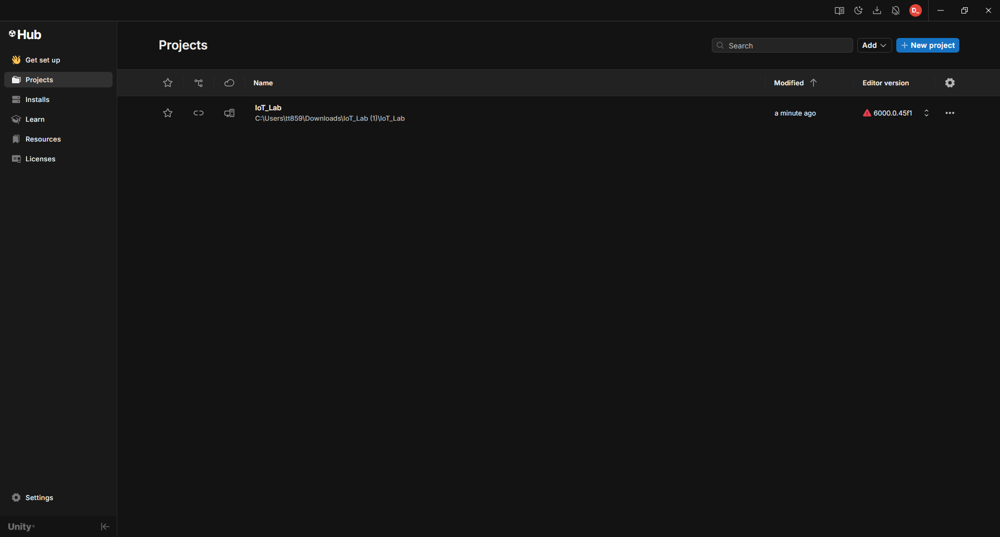
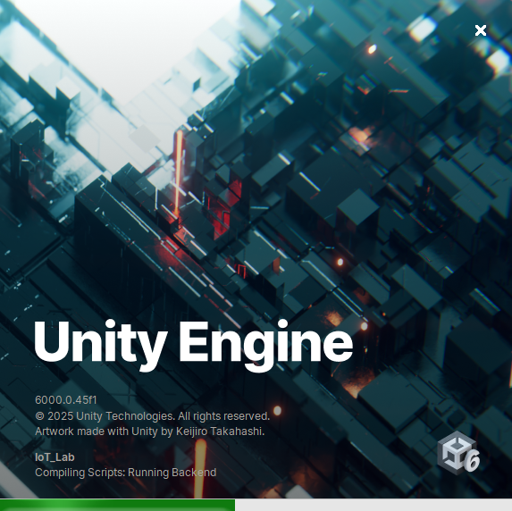

:toc-title: Sommaire
:toc: macro
:toclevels: 3
:sectnums:

= Documentation Utilisateur

toc::[]

== Présentation de l’application

=== Contexte général

****
**Nom du projet :** LocURa4IoT
****

=== Sujet et présentation

****
Le projet porte sur la réalité virtuelle appliquée à l’accès à distance de la plateforme **LocURa4IoT**.  
Un modèle 3D a été développé l’année dernière par un graphiste sous **Unity**.  
L’objectif est de faire évoluer ce modèle pour permettre l’ajout dynamique d’objets dans l’environnement.

Actuellement, cela est possible uniquement en modifiant le code et en recompilant le projet.  
L’idée est donc de **développer une API** permettant d’ajouter des objets sans recompilation.
****

== Installation

=== Prérequis

****
- **PC Windows 10/11** (recommandé pour Link).  
  *macOS* peut compiler un APK Android mais **Meta Quest Link** (Play in Editor) n’est **pas** supporté sur macOS.
- **Meta Quest 3** + câble USB-C (ou Wi-Fi via Air Link)
- **Unity Hub**
- **Visual Studio** (recommandé)
****

=== Étapes d’installation

. Installer https://unity.com/fr/download[Unity Hub et Unity].  
  Version recommandée : *2021.3.18f1 LTS* ou la dernière LTS supportée.
. Installer https://developer.android.com/studio?hl=fr[Android Studio].  
  Recommandé pour la compilation Android.
. Installer le https://assetstore.unity.com/packages/tools/integration/meta-xr-all-in-one-sdk-269657[Meta XR All-in-One SDK].  
  *(Remplace **Oculus Integration**, désormais déprécié.)*

== Configuration

=== Configuration Unity

==== Prérequis

****
Se connecter à son **compte Unity** (gratuit).
****

. Ouvrir **Unity Hub**  

. Importer le projet Unity (bouton *Add* en haut à droite)  

. Ouvrir le projet  

. Exemple de projet ouvert  

== Utilisation

=== Contrôle du rail

Il est possible de piloter le rail de **sept mètres** de la plateforme en publiant des requêtes **MQTT** depuis l’application.  
La position du chariot se met à jour en **temps réel** sur la tablette virtuelle et dans la scène 3D.

=== Affichage des positions des nœuds

Les positions réelles et estimées des **nœuds** sont affichées dynamiquement :  

- Nœuds **non connectés** → cubes **gris**  
- Nœuds **connectés** → cubes **bleu clair**  
- Positions **estimées** → cubes **rouges**

=== État des portes

L’application récupère l’état (**ouvert/fermé**) des portes via des **capteurs**, ce qui permet de visualiser leur état en temps réel, car cela peut influencer les mesures.

=== Représentation des mesures de ranging

Deux types de représentations sont disponibles :

. **Lignes droites** entre les nœuds et les ancres.  
. **Sphères** dont le centre correspond à l’ancre et le rayon à la distance mesurée.
